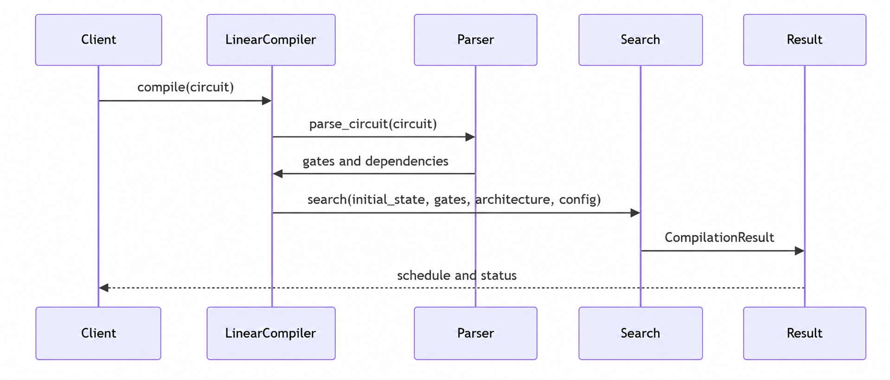

# Linear Compiler Architecture

This page gives a high-level view of the Linear compiler package: how its main
pieces fit together, where the hardware model ends and compiler policy begins,
and how the design can be extended. For instructions on compiling a circuit, see
the {doc}`Linear compiler guide <linear_compiler>`. The
{doc}`trapped-ion hardware model <linear_hardware_model>` describes the physical
abstractions behind the architecture.

## Overall structure

The design follows the same broad separation used in a physical control stack.
The hardware model describes what the device offers and what each control
operation does. The compiler decides when to use those operations to realize a
circuit.

<figure>
  <a href="_static/linear_compiler_sequence.png">
    
  </a>
  <figcaption>The main compilation path from circuit input to a schedule and
  completion status.</figcaption>
</figure>

This direction of dependency is intentional. The compiler knows enough about the
hardware to construct a valid schedule, while the hardware model does not need
to know about A-star search, circuit dependencies, or compiler heuristics.
Likewise, later analysis and control passes consume a compiled schedule without
becoming dependencies of the base search.

## The main layers

Reading the figure from left to right, the public compiler coordinates circuit
preparation, schedule search, and result construction. The hardware model and
compiler state support that path without depending on the search strategy.

### Public compiler interface

{py:class}`~mqt.ionshuttler.linear.LinearCompiler` is the main entry point. It
holds an architecture and configuration, accepts a circuit, creates its initial
state, and returns a {py:class}`~mqt.ionshuttler.linear.CompilationResult`.

The facade keeps these preparation steps consistent and keeps the lower-level
search machinery out of normal user code. Compilation itself has no output-file
side effects; saving a result is a separate, explicit operation.

### Hardware model

The hardware-facing part consists of three ideas:

- {py:class}`~mqt.ionshuttler.linear.Architecture` describes sites, processing
  zones, and optional site-dependent field information.
- {py:class}`~mqt.ionshuttler.linear.HardwareTiming` describes the duration and
  implementation of transport and gate operations.
- {py:class}`~mqt.ionshuttler.linear.actions.Action` represents a control
  primitive that may change the hardware state.

An action owns the rules and effects that are intrinsic to that operation:

```python
class Action:
    def is_valid(self, state, architecture) -> bool: ...
    def apply(self, state, architecture): ...
    def to_dict(self) -> dict[str, object]: ...
```

For example, a shuttle knows that it moves one ion between adjacent sites, and a
gate knows which ions and processing-zone resources it occupies. These rules
live with the action so adding a new hardware primitive does not require a
central list of every supported action type.

### Compiler state

{py:class}`~mqt.ionshuttler.linear.state.State` is the meeting point between the
hardware model and the scheduler. It records:

- the current ion positions, device time, and resource availability; and
- which circuit gates are complete or still running.

States are immutable and hashable. The search can therefore compare candidate
schedules and recognize a previously visited state without worrying that an
earlier candidate was modified in place.

Physical actions update only the hardware-related part of the state. The
compiler separately updates gate progress. This split is intentional to mirror
the relationship between an application-facing compiler and the
application-agnostic physical device controller.

### Circuit preparation

Circuit preparation translates Qiskit or QASM input into supported gate actions
and identifies which gates may run independently. It also applies the selected
hardware timing and virtual-gate choices. This layer sits above the hardware
primitives and immediately before schedule search. Circuit-level optimization is
deliberately outside the scope of the Linear compiler.

### Scheduling and search

The compiler owns decisions involving more than one action or the logical
circuit as a whole. This includes:

- deciding which gates are ready from their dependencies;
- proposing transport and gate actions;
- checking conflicts between simultaneous operations;
- advancing time and completing scheduled gates; and
- choosing which candidate schedule to explore next.

The current search uses elapsed schedule time and, by default, a routing/depth
heuristic to guide A-star search. Search settings control practical tradeoffs
such as heuristic choice, rolling horizons, frontier size, and time limits. A
zero heuristic supports an exact but potentially much slower search profile.
Hardware timing remains separate from these choices: changing a search
preference does not redefine how long the hardware takes to perform an
operation.

Individual action validity and scheduler policy are deliberately distinct. An
idle time advance, for example, can be a meaningful operation in the state
model, while the compiler may choose not to generate unhelpful idle branches.
This prevents a search preference from being mistaken for a physical rule.

### Compilation result and downstream work

The result contains the selected action sequence, completion status, makespan,
and supporting state and architecture information. It is the boundary between
base compilation and later consumers such as visualization, analysis, or
additional control passes.

Downstream passes sit on top of compilation. They consume a result and may
produce a revised schedule together with method-specific diagnostics.

Examples of downstream consumers include:

- shuttling-aware dynamical-decoupling passes; and
- visualization tools that consume the JSON representation.

## Extending the hardware model

The hardware model is designed with future additions and custom modifications in
mind. The following sections outline how to extend the abstraction.

### Define a custom action

A hardware-specific control primitive can subclass `Action` or one of its
physical-action bases. A minimal action defines its data, its local eligibility
rule, and its state change:

```python
from dataclasses import dataclass, replace

from mqt.ionshuttler.linear.actions import PhysicalAction


@dataclass(frozen=True)
class CoolingPulse(PhysicalAction):
    ion: int
    duration: int = 2

    def is_valid(self, state, architecture) -> bool:
        del architecture
        if self.ion not in dict(state.positions):
            return False
        busy_until = dict(state.ions_busy_until)
        return busy_until.get(self.ion, state.time + 1) <= state.time

    def apply(self, state, architecture):
        del architecture
        busy_until = dict(state.ions_busy_until)
        busy_until[self.ion] = state.time + self.duration
        return replace(
            state,
            ions_busy_until=tuple(sorted(busy_until.items())),
        )
```

The inherited `to_dict` method serializes dataclass fields, and the normal
single-action validity interface can use the new class without adding another
central dispatch branch.

Defining an action does not automatically tell the compiler when it is useful.
To make `LinearCompiler` select a new primitive, its candidate-generation policy
must also propose that action. This is a compiler concern rather than an action
concern: the action describes what the hardware can do, while generation
describes how a particular compiler intends to use it.

If saved results contain a custom action, provide its decoder explicitly when
loading:

```python
from mqt.ionshuttler.linear import CompilationResult

result = CompilationResult.load(
    "schedule.json",
    action_decoders={"CoolingPulse": decode_cooling_pulse},
)
```

Decoders are supplied per call rather than installed in global state. Separate
applications can therefore use different action sets without changing one
another's behavior at import time.

### Add broader behavior

Extensions usually belong to one of three places:

- **New hardware capability:** define an action and, when necessary, extend the
  architecture data it reads.
- **New compilation strategy:** change or add candidate generation and search
  policy while keeping action behavior local.
- **New analysis or control pass:** consume a `CompilationResult` downstream and
  return its own result or report without coupling the base compiler to the
  method.

Operations such as merge, split, partial global controls, or blocking global
controls may have quite different local physics. The action boundary allows
those rules to remain close to the operation, while shared scheduling concerns
such as circuit order and conflicts across a whole timestep remain in the
compiler.

## Design principles

The package follows a few recurring principles:

- **Hardware capability and compiler preference are different concepts.**
  Physical eligibility belongs to the model; pruning and prioritization belong
  to the compiler.
- **Timing is explicit.** Hardware durations are inputs to scheduling rather
  than hidden assumptions in search code.
- **State changes are local and immutable.** This makes actions easier to reason
  about and states safe to compare during search.
- **Extension points are explicit.** Custom behavior is passed into the place
  that owns it instead of being installed through global registries.
- **The public boundary is small.** Most users need an architecture, a typed
  configuration, `LinearCompiler.compile`, and the returned result.
- **Downstream methods depend on compilation, not the reverse.** The base
  compiler remains useful without optional analysis or control layers.

## See also

- {doc}`linear_compiler` — configure and run the Linear compiler
- {doc}`linear_hardware_model` — physical interpretation of the modeled device
- {doc}`api/mqt/ionshuttler/linear/index` — complete Linear Python API reference
